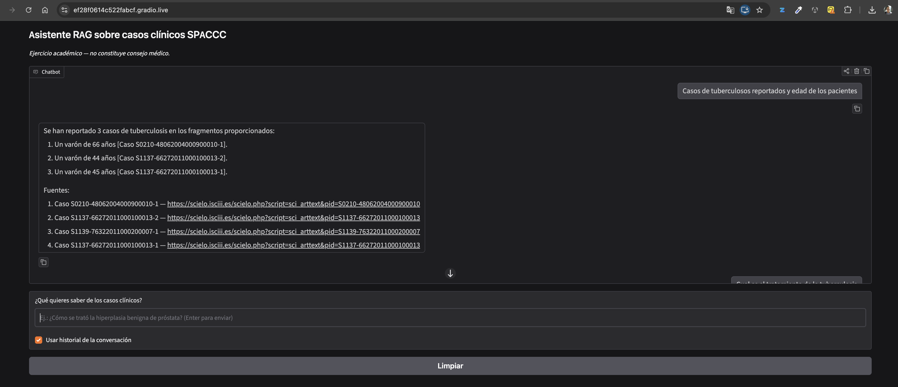
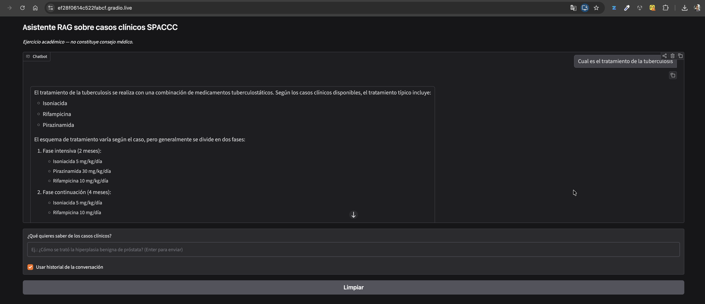
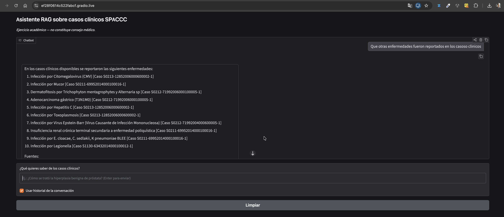

# Procesamiento de Lenguaje Natural — Talleres


[](https://colab.research.google.com/github/jose-milciades/NLP_taller_1/blob/main/notebook_taller_1.ipynb)

Repositorio del curso de Maestría en **Procesamiento de Lenguaje Natural**. Reúne la solución de los distintos talleres de la materia, todos construidos sobre el **mismo corpus clínico en español**, pero explorando **modelos, arquitecturas, hiperparámetros y bibliotecas diferentes** en cada entrega. Esto permite comparar, taller a taller, distintos enfoques frente a un mismo problema de referencia.

## Tabla de contenido

- [Integrantes](#integrantes)
- [Dataset](#dataset)
- [Estructura del repositorio](#estructura-del-repositorio)
- [Taller 1 — NER híbrido (spaCy + Bi-LSTM)](#taller-1--sistema-híbrido-de-reconocimiento-de-entidades-spacy--bi-lstm)
- [Taller 2 — NER con Transformer encoder](#taller-2--ner-con-transformer-encoder)
- [Taller 3 — NER con BERT preentrenado](#taller-3--ner-con-bert-preentrenado)
- [Taller 4 — Generación de casos clínicos con GPT-2](#taller-4--generación-de-casos-clínicos-con-gpt-2)
- [Taller 5 — RAG sobre casos clínicos SPACCC](#taller-5--rag-sobre-casos-clínicos-spaccc-con-ollama)
- [Cómo ejecutar los cuadernos](#cómo-ejecutar-los-cuadernos)
- [Licencia](#licencia)

## Integrantes

**Carlos Javier Cepeda, David Salamanca, Jose Milciades Ordoñez**

## Dataset

Todos los talleres usan el corpus clínico **SPACCC (Spanish Clinical Case Corpus)**, publicado en Hugging Face:

| Recurso | Contenido |
|---|---|
| [`IEETA/SPACCC-Spanish-NER`](https://huggingface.co/datasets/IEETA/SPACCC-Spanish-NER) | Anotaciones NER: 750 documentos de entrenamiento (33,757 anotaciones) y 250 de test (11,239 anotaciones) |
| [`IEETA/SPACCC-documents`](https://huggingface.co/datasets/IEETA/SPACCC-documents) | Texto completo de cada historia clínica |

Categorías anotadas: `CHEMICAL`, `DISEASE`, `PROCEDURE`, `PROTEIN`, `SYMPTOM`.

## Estructura del repositorio

```
NLP_taller_1/
├── README.md
├── notebook_taller_1.ipynb   # Taller 1: NER híbrido spaCy + Bi-LSTM
├── notebook_taller_2.ipynb   # Taller 2: NER con Transformer encoder desde cero
├── notebook_taller_3.ipynb   # Taller 3: BERT preentrenado; etapa de descarga de datos
├── notebook_taller_4_v1.ipynb # Taller 4: fine-tuning generativo de GPT-2
├── notebook-taller-5-rag.ipynb # Taller 5: RAG con Ollama sobre SPACCC
└── test/                     # Capturas del chat RAG (taller 5)
    ├── pregunta1_rag.png
    ├── pregunta2_rag.png.png
    └── pregunta3_rag.png.png
```

Cada taller nuevo se documenta en una sección propia de este README y, cuando aplique, en su propio cuaderno (`notebook_taller_N.ipynb`) o carpeta, manteniendo el mismo dataset como base de comparación.

## Taller 1 — Sistema Híbrido de Reconocimiento de Entidades (spaCy + Bi-LSTM)

**Cuaderno:** [`notebook_taller_1.ipynb`](notebook_taller_1.ipynb) · [](https://colab.research.google.com/github/jose-milciades/NLP_taller_1/blob/main/notebook_taller_1.ipynb)

### Objetivo

Construir un modelo de NLP que no solo procese palabras aisladas, sino que entienda el contexto y la terminología médica especializada para extraer información crítica (síntomas, medicamentos, patologías) de historias clínicas.

### Arquitectura

El núcleo del taller es una arquitectura híbrida que fusiona conocimiento lingüístico simbólico con aprendizaje profundo, en lugar de dejar que la red aprenda gramática española desde cero:

- **spaCy** (`es_core_news_sm`) — extractor de características: tokeniza el texto y obtiene el POS (Part-of-Speech) de cada token.
- **Bi-LSTM** (PyTorch) — motor de contexto: red bidireccional que recibe los embeddings de palabra (y, opcionalmente, los de POS concatenados) y predice, token por token, la etiqueta BIO correspondiente.

Se entrenan y comparan dos variantes:

| Variante | Entrada al modelo |
|---|---|
| `con_pos` | Embedding de palabra + embedding de POS |
| `sin_pos` | Solo embedding de palabra (control experimental) |

### Metodología

El cuaderno está organizado en 12 pasos secuenciales, pensados para ejecutarse en Kaggle con GPU (2× Tesla T4):

1. Instalación de dependencias y modelo de spaCy.
2. Configuración, semillas y verificación de GPU.
3. Descarga y auditoría del corpus.
4. Partición fija por documento (`split_seed=42`): 600 train / 150 validación / 250 test reservado.
5. Tokenización, alineación de offsets y construcción de etiquetas BIO.
6. Vocabulario, `DataLoader` y función de pérdida ponderada por clase.
7. Definición de la Bi-LSTM y de las métricas de evaluación (coincidencia exacta de entidades).
8. Prueba técnica (smoke test) antes de entrenar.
9. Seis entrenamientos independientes: 2 variantes × 3 semillas (`42`, `123`, `2026`).
10. Agregación de resultados (media, desviación estándar, diferencias pareadas).
11. Evaluación final sobre el conjunto de test (opcional, deshabilitada por defecto).
12. Inferencia interactiva sobre texto nuevo.

### Resultados

Comparación multisemilla en validación (F1 en %):

| Variante | F1 medio | Desv. estándar | Precisión media | Recall medio |
|---|---:|---:|---:|---:|
| `con_pos` | **38.96 %** | 0.51 % | 32.44 % | 48.76 % |
| `sin_pos` | 37.13 % | 1.30 % | 30.90 % | 46.53 % |

La variante con POS obtuvo mayor F1 en las tres semillas evaluadas, con una mejora media de **+1.83 puntos porcentuales**. En la evaluación final sobre el conjunto de test reservado (`con_pos`, semilla 42) se obtuvo un F1 micro de **39.17 %** sobre 9,415 entidades.

### Limitaciones

- Esquema BIO plano: las anotaciones anidadas o solapadas se excluyen y se contabilizan, no se modelan.
- La confianza reportada en la inferencia interactiva no está calibrada.
- La comparación usa una única partición fija y tres semillas; la desviación estándar describe variabilidad de entrenamiento, no significancia estadística.
- Las predicciones son un ejercicio académico y no sustituyen una decisión clínica.

## Taller 2 — NER con Transformer encoder

**Cuaderno:** [`notebook_taller_2.ipynb`](notebook_taller_2.ipynb) · [](https://colab.research.google.com/github/jhavierc/NLP_taller_1/blob/main/notebook_taller_2.ipynb)

### Objetivo

Reemplazar la Bi-LSTM de taller 1 por un encoder Transformer implementado desde cero, manteniendo exactamente el mismo corpus, partición, preprocesamiento y variantes con/sin POS, para aislar el efecto de cambiar únicamente la arquitectura.

### Arquitectura

Transformer encoder construido en PyTorch pieza por pieza (sin pesos preentrenados): positional encoding sinusoidal, atención multi-cabeza, conexiones residuales y normalización. Reutiliza el mismo extractor de taller 1 (spaCy `es_core_news_sm` para tokenización y POS) y el mismo esquema de etiquetas BIO.

- 2 bloques Transformer, 4 cabezas de atención, dimensión interna (`d_model`) 128.
- Embeddings de palabra (64) y, opcionalmente, de POS (16) entrenados desde cero; cabezal lineal a las 11 etiquetas BIO.

Mismas dos variantes de taller 1:

| Variante | Entrada al modelo |
|---|---|
| `con_pos` | Embedding de palabra + embedding de POS |
| `sin_pos` | Solo embedding de palabra (control experimental) |

### Metodología

El cuaderno está organizado en 14 pasos secuenciales (más un sub-paso 11B), pensados para ejecutarse en Kaggle con GPU (2× Tesla T4):

1. Instalación de dependencias y modelo de spaCy.
2. Configuración, semillas y verificación de GPU.
3. Descarga y auditoría del corpus.
4. Análisis exploratorio de los datos (EDA): distribución de clases, longitud de entidades, densidad por documento.
5. Partición fija por documento (idéntica a taller 1: 600 train / 150 validación / 250 test reservado).
6. Tokenización, alineación de offsets y construcción de etiquetas BIO.
7. Vocabulario, `DataLoader` y función de pérdida ponderada por clase.
8. Definición del Transformer encoder y de las métricas de evaluación (misma coincidencia exacta de entidades de taller 1).
9. Prueba técnica (smoke test) de las dos variantes.
10. Seis entrenamientos independientes: 2 variantes × 3 semillas (`42`, `123`, `2026`).
11. Agregación de resultados (media, desviación estándar, diferencias pareadas).
   - **11B.** Comparación automática contra la línea base histórica de taller 1 (embebida en el propio cuaderno con su procedencia), verificando antes que datos, partición y preprocesamiento coincidan exactamente.
12. Evaluación final sobre el conjunto de test — habilitada por defecto: la variante se selecciona por mayor F1 medio de validación y la semilla queda fijada en 42 desde antes de entrenar.
13. Inferencia interactiva sobre texto nuevo.
14. Experimento editable: reentrena una variante/semilla con hiperparámetros modificados, para exploración rápida sin rehacer todo el cuaderno.

### Resultados

Comparación multisemilla en validación (F1 en %):

| Variante | F1 medio | Desv. estándar | Precisión media | Recall medio |
|---|---:|---:|---:|---:|
| `con_pos` | **26.69 %** | 1.73 % | 19.94 % | 40.54 % |
| `sin_pos` | 24.98 % | 2.26 % | 18.21 % | 40.14 % |

La variante con POS ganó en las tres semillas (mejora media **+1.71 puntos porcentuales**) — el mismo patrón cualitativo que taller 1. Frente a la Bi-LSTM (PASO 11B), el Transformer queda **~12 puntos porcentuales por debajo en ambas variantes, en las tres semillas sin excepción** (`con_pos`: 26.69 % vs 38.96 %; `sin_pos`: 24.98 % vs 37.13 %). En el test final (`con_pos`, semilla 42) se obtuvo un F1 micro de **25.13 %** sobre 9,415 entidades, consistente con el F1 de validación.

Hallazgo exploratorio (PASO 14, una sola semilla): desactivar los pesos por clase (`class_weights=False`) mejoró el F1 de 28.11 % a **37.22 %** (+9.11 pp) en la semilla 123, y redujo casi a la mitad las transiciones BIO inválidas — una pista más prometedora que la profundidad o el POS para mejorar este modelo, pendiente de confirmar con las tres semillas.

### Limitaciones

- Mismas limitaciones de esquema BIO plano y partición fija de taller 1; la comparación contra la Bi-LSTM es descriptiva (arquitecturas con distinto número de parámetros).
- El modelo sobre-predice de forma sistemática (recall ~2× la precisión) y genera muchas transiciones BIO inválidas, tanto en validación como en test — el cuello de botella principal no parece ser la falta de POS ni la profundidad, sino la propia arquitectura desde cero.
- El hallazgo del PASO 14 sobre `class_weights` usa una sola semilla y debe confirmarse con las tres antes de adoptarse como configuración base.
- La confianza reportada en la inferencia interactiva no está calibrada.

## Taller 3 — NER con BERT preentrenado

**Cuaderno:** [`notebook_taller_3.ipynb`](notebook_taller_3.ipynb).

Desarrollo paso a paso a partir del ejemplo de clase `1_text_classification_with_hf.ipynb`. Usaremos BETO para clasificación por token sobre SPACCC. La versión actual incluye descarga y auditoría del corpus, inspección BIO con spaCy, partición fija de 600/150/250 documentos y análisis del tokenizador de BETO. El PASO 05 muestra longitudes, fragmentación, alineación al primer subtoken y diagnóstico de ventanas en entrenamiento y validación. Todavía no se construyen lotes ni se cargan pesos de BERT.

Activar Internet en Kaggle y ejecutar las celdas en orden; esta primera etapa no requiere GPU. Los datos y la auditoría `data_summary.json` se guardan en `spaccc_bert/` (bajo `/kaggle/working/` en Kaggle).

## Taller 4 — Generación de casos clínicos con GPT-2

**Cuaderno:** [`notebook_taller_4_v1.ipynb`](notebook_taller_4_v1.ipynb) · [](https://colab.research.google.com/github/jhavierc/NLP_taller_1/blob/main/notebook_taller_4_v1.ipynb)

### Objetivo

Cambiar de tarea y de arquitectura frente a los talleres 1-3: en vez de clasificación de tokens (NER), se hace **fine-tuning generativo** de un GPT-2 en español, partiendo del notebook guía de la sesión (que ajusta GPT-2 sobre un corpus de chistes) pero aplicado al mismo corpus clínico **SPACCC** de los talleres anteriores. Pregunta de investigación: ¿cuánto mejora un GPT-2 de dominio general al especializarse en texto clínico, cómo se mide esa mejora de forma comparable entre modelos con vocabularios (tokenizadores) distintos, y qué pierde el modelo en el camino (olvido catastrófico)?

### Arquitectura

- **Checkpoint principal:** `mrm8488/spanish-gpt2` (`GPT2LMHeadModel`, 124.4 M de parámetros, 12 capas, 12 cabezas, contexto de 1024 tokens).
- **Segundo checkpoint:** `DeepESP/gpt2-spanish` (163.0 M de parámetros), entrenado con el mismo protocolo en el PASO 12. No es una comparación de dominio general vs. clínico (ambos son GPT-2 españoles de propósito general): el objetivo es metodológico — como cada uno trae su propio tokenizador, sus perplejidades no son comparables entre sí, así que la comparación se hace en **bits por carácter** (misma unidad, independiente del vocabulario).
- **Preparación de datos — concatenar y trocear, no truncar:** a diferencia del notebook guía (trunca cada ejemplo a 64 tokens, descartando el resto), aquí se tokeniza cada documento completo, se concatenan con un token `EOS` entre documentos y la secuencia resultante se trocea en bloques contiguos de **256 tokens** (`block_size=256`). Esto aprovecha **2.1× más material de entrenamiento** (1.425 bloques frente a los 675 que daría truncar a 64 tokens).
- Fine-tuning completo (todos los pesos, sin variante frozen) con `Trainer` + `DataCollatorForLanguageModeling(mlm=False)` — modelado de lenguaje causal, 3 épocas, `learning_rate=5e-5`, lote 8, semilla 42.

### Metodología

El cuaderno está organizado en 16 pasos secuenciales:

1. Entorno y dependencias.
2. Configuración, semillas y verificación de GPU.
3. Descarga y auditoría del corpus SPACCC (documentos completos + anotaciones).
4. Análisis exploratorio en 5 partes: longitud de documentos, vocabulario y ley de Zipf, estructura retórica y demografía, terminología clínica anotada, y **fertilidad comparada de los tokenizadores** (subtokens por palabra en texto clínico vs. general).
5. Partición fija por documento, sin fuga entre entrenamiento/validación/test.
6. Preparación de bloques de 256 tokens (concatenar y trocear).
7. Carga del modelo base y generación de muestra sin ajustar, con una función de generación propia (muestreo con núcleo `top_p`).
8. Perplejidad y bits por carácter del modelo base sobre el test reservado, antes de entrenar.
9. Fine-tuning del checkpoint principal.
10. Perplejidad y bits por carácter después del ajuste; comparación de generaciones y marcadores léxicos de cambio de registro.
11. Comparación cuantitativa de 5 estrategias de decodificación (greedy, beam, muestreo, top-k, núcleo top-p) con métricas de diversidad (`distinct-n`) y repetición de 4-gramas.
12. Repetición de todo el protocolo con el segundo checkpoint (`DeepESP/gpt2-spanish`).
13. Medición del olvido catastrófico: bits por carácter antes/después sobre un corpus de control de dominio general.
14. Demo de generación guiada a partir de variables clínicas (sexo, edad, antecedente) y auditoría de si el modelo condiciona el texto según la edad indicada.
15. Resumen automático de todas las cifras de la corrida.
16. Hallazgos, limitaciones, consideraciones éticas y conclusiones.

### Resultados

Perplejidad y bits por carácter del checkpoint principal (`mrm8488/spanish-gpt2`), test reservado:

| | Perplejidad | Bits por carácter |
|---|---:|---:|
| Antes de ajustar | 55.71 | 1.353 |
| Después de ajustar | **27.41** | **1.114** |
| Mejora | **−50.8 %** | **−17.6 %** |

Comparación entre los dos checkpoints (misma unidad, bits por carácter):

| Checkpoint | Parámetros | Bpc antes | Bpc después | Mejora |
|---|---:|---:|---:|---:|
| `mrm8488/spanish-gpt2` | 124.4 M | 1.353 | **1.114** | −17.6 % |
| `DeepESP/gpt2-spanish` | 163.0 M | 1.737 | 1.233 | −29.0 % |

Hallazgo metodológico central: en perplejidad, `gpt2-spanish` parece quedar muy por detrás después de ajustar (36.0 vs. 27.4, **+31.3 %** de brecha), pero en bits por carácter —la métrica correcta cuando los vocabularios difieren— la brecha real es de solo **+10.6 %**. Reportar perplejidad entre tokenizadores distintos exagera la diferencia casi al triple.

Cambio de registro (marcadores léxicos por 100 palabras generadas): los marcadores clínicos se **duplican**, de 3.18 (base) a 6.66 (ajustado); los marcadores de español general, pensados como contraparte, se midieron en 0.00 en ambos modelos (ver limitaciones).

Estrategias de decodificación (sobre el modelo ajustado):

| Estrategia | distinct-1 | distinct-2 | 4-gramas repetidos |
|---|---:|---:|---:|
| Greedy | 0.066 | 0.105 | 74.0 % |
| Beam (4 haces) | 0.052 | 0.065 | 72.5 % |
| Muestreo T=1.0 | 0.636 | 0.953 | **0.0 %** |
| Top-k (k=50) | 0.531 | 0.894 | 2.7 % |
| Núcleo top-p (0.92) | 0.473 | 0.849 | 0.3 % |

Greedy y beam degeneran en repetición masiva; el muestreo puro es el más diverso, pero el cuaderno elige `top_p=0.92` para la demo final por razones cualitativas (terminología médica más plausible), reconociendo explícitamente que estas métricas de diversidad no miden coherencia ni favorecen esa elección.

Olvido catastrófico: el dominio general de control **no empeoró** tras el ajuste (1.049 → 1.014 bpc, −3.4 %) — un resultado inesperado que el propio cuaderno atribuye con cautela al tamaño mínimo del corpus de control (solo 2 bloques), no a una ausencia real de olvido catastrófico.

### Limitaciones

- Una sola semilla de entrenamiento por checkpoint; la brecha del 10.6 % entre checkpoints no se validó con variabilidad.
- La lista de marcadores de español general no disparó nunca (0.00 en ambos modelos): la mitad de la evidencia sobre cambio de registro quedó sin usar.
- El corpus de control del olvido catastrófico tiene solo 2 bloques (5 párrafos escritos a mano): alcanza para ver una dirección, no para cuantificarla con confianza.
- `block_size=256` puede partir un informe clínico por la mitad, limitando el aprendizaje de su estructura completa.
- Las métricas de diversidad (`distinct-n`, repetición de 4-gramas) no miden calidad ni coherencia; no hay evaluación humana ni verificación factual del texto generado.
- El modelo genera texto con forma de informe clínico pero contenido estadístico, no médico: no debe usarse para ninguna decisión clínica ni para documentar pacientes reales.

## Taller 5 — RAG sobre casos clínicos SPACCC con Ollama

**Cuaderno:** [`notebook-taller-5-rag.ipynb`](notebook-taller-5-rag.ipynb)

### Objetivo

Cambiar otra vez de tarea sobre el mismo corpus. En los talleres 1 a 4 los 1.000 casos de SPACCC sirvieron para entrenar modelos (NER o generación). Aquí no se entrena nada: los documentos son la **base de conocimiento** de un sistema RAG, y un LLM local servido con Ollama responde preguntas en español y cita el caso de SciELO del que salió la información. La estructura sigue el notebook de la Sesión 5 (RAG sobre Wikihow); las decisiones de chunking y de encoder se justifican con el propio corpus antes de indexar.

### Decisiones de diseño

El dataset de documentos solo trae `filename` y `document`. No hay título, resumen ni URL, así que el cuaderno deriva el identificador del caso, la URL del artículo en SciELO y, a partir de las anotaciones NER, la partición y el conteo de entidades. Esos metadatos son los que después aparecen en las citas.

| Decisión | Evidencia en el corpus | Elección |
|---|---|---|
| Partir los documentos | Mediana de 548 tokens; el 55,8 % supera el límite de 512 del encoder | Chunking, no documento completo |
| Unidad de corte | ~1,7 tokens por palabra; bloques fijos de 100 palabras cortan una oración en el 95 % de los chunks | Recursivo: párrafo → oración → `;` → `,` → espacio, medido en tokens |
| Tamaño | 128 tokens deja chunks de una o dos oraciones; 384 mezcla varias fases del caso | **256 tokens**, solapamiento **48** (~19 %) |
| Contexto del paciente | Un chunk intermedio ya no dice quién es el paciente | Cabecera con las primeras 25 palabras del caso |
| Encoder | Benchmark de recuperación con consultas sintéticas armadas desde las entidades NER | `intfloat/multilingual-e5-large` |
| LLM | Generación condicionada al texto recuperado, no a los embeddings | `qwen2.5:7b` vía Ollama |

El chunking deja **3.544 fragmentos** (3,54 por documento). La cabecera contextual sube el MRR@10 de `e5-large` de 0,601 a 0,649.

### Resultados

Calidad de recuperación sobre 199 consultas y 200 documentos (el orden de calidad no depende del dispositivo; las velocidades son las de la corrida con GPU):

| Encoder | MRR@10 | Recall@1 | Recall@5 | Chunks/s |
|---|---:|---:|---:|---:|
| `multilingual-e5-large` | **0,649** | **0,548** | **0,799** | 23,4 |
| `multilingual-e5-small` | 0,616 | 0,528 | 0,749 | 180,9 |
| `multilingual-e5-base` | 0,609 | 0,508 | 0,724 | 78,8 |
| `BAAI/bge-m3` | 0,557 | 0,472 | 0,668 | 22,6 |
| `paraphrase-multilingual-mpnet` | 0,222 | 0,146 | 0,327 | 138,1 |

`e5-large` es el que elige la regla del cuaderno (el más rápido entre los que quedan a ≤ 0,02 de MRR del mejor). `e5-base` no supera a `e5-small`. `bge-m3`, pese a ser de los modelos más capaces en benchmarks generales, queda por debajo de la familia E5 en este dominio. `mpnet` se desploma porque trunca el 85,6 % de los chunks a 128 tokens y fue entrenado para similitud simétrica, no para recuperación pregunta–pasaje.

El vector store final es de forma `(3544, 1024)` y se calculó en 176 s. Sobre el índice completo (999 consultas, 1.000 documentos compitiendo), `e5-large` obtiene Recall@1 = 0,426, Recall@5 = 0,622, Recall@10 = 0,680 y MRR@10 = 0,506. En torno a 6 de cada 10 preguntas sobre un caso concreto, ese caso entra en el contexto del LLM.

Frente al LLM sin contexto, el RAG responde con datos del corpus (diagnóstico, fármacos, dosis), cita el caso y, ante una pregunta fuera de dominio, dice que no está en los documentos. Sin RAG, el mismo modelo inventó que Argentina ganó el Mundial de 2010.

### Evidencia de funcionamiento

Capturas de la interfaz Gradio de la misma corrida (`e5-large` + `qwen2.5:7b`). El aviso de la interfaz recuerda que es un ejercicio académico y no un consejo médico.

Pregunta por casos de tuberculosis y edad del paciente. La respuesta enumera tres casos con la edad y cierra con enlaces a SciELO:



Pregunta por el tratamiento. La respuesta se apoya en los casos recuperados: isoniazida, rifampicina y pirazinamida, con fase intensiva de 2 meses y fase de continuación de 4 meses:



Pregunta de seguimiento por otras enfermedades del corpus. Cada enfermedad queda ligada al identificador del caso:



### Limitaciones

- Si el recuperador no trae el fragmento correcto, la respuesta falla aunque el corpus tenga el dato. En la evaluación del cuaderno, la pregunta por tumoraciones del mediastino no recuperó casos pertinentes, y 19 documentos mencionan el mediastino.
- El modelo puede mezclar hechos dentro del contexto recuperado. En la prueba de la resección transuretral atribuyó a esa cirugía una fístula de LCR que, en el caso citado, fue complicación de otro procedimiento. Las citas permiten detectarlo; no lo impiden.
- La lista de fuentes incluye todos los casos recuperados, no solo los que la respuesta usó. En la primera captura se enumeran tres pacientes y cuatro enlaces.
- Ollama no detectó la GPU en esa sesión de Kaggle (`Unable to detect NVIDIA/AMD GPU`): los embeddings sí corrieron en CUDA; el LLM de 7B pudo haber generado en CPU.
- El sistema no razona clínicamente. Genera texto condicionado a los fragmentos recuperados y no sustituye una fuente médica ni una decisión clínica.

## Cómo ejecutar los cuadernos

1. Abrir el cuaderno correspondiente en un entorno con GPU e Internet habilitado:
   - **Kaggle** (entorno original, recomendado para reproducir los resultados reportados): acelerador **GPU T4 ×2**.
   - **Google Colab**: usa el botón *Abrir en Colab* de arriba, o el badge dentro del propio cuaderno. El plan gratuito de Colab entrega **una sola GPU T4**, así que antes de ejecutar el PASO 02 cambia `requested_gpus=1` (o `allow_cpu_for_debug=True` para depurar sin GPU); el cuaderno funciona igual, pero sin `DataParallel` y con tiempos de entrenamiento distintos a los reportados en el informe final.
2. Ejecutar las celdas en orden desde el PASO 01; cada paso valida sus propias precondiciones y detiene la ejecución con un mensaje claro si algo falta.
3. Los artefactos (checkpoints, métricas, `summary.json`, tablas `comparison_*.csv`) quedan guardados en una carpeta con marca de tiempo dentro de `spaccc_gpu/` para el taller 1 o `spaccc_transformer/` para el taller 2, bajo `/kaggle/working/` en Kaggle.
4. El taller 5 (`notebook-taller-5-rag.ipynb`) también pide GPU e Internet. Instala Ollama, descarga `qwen2.5:7b` y publica el chat de Gradio al final. El índice queda en `data_taller5/` (está en `.gitignore`). Si Ollama no ve la GPU o falta memoria de video, cambia `CFG['llm_model']` a `qwen2.5:3b`.

## Licencia

Proyecto académico desarrollado para el curso de Maestría en Procesamiento de Lenguaje Natural. El corpus SPACCC conserva la licencia de sus autores originales en Hugging Face.
